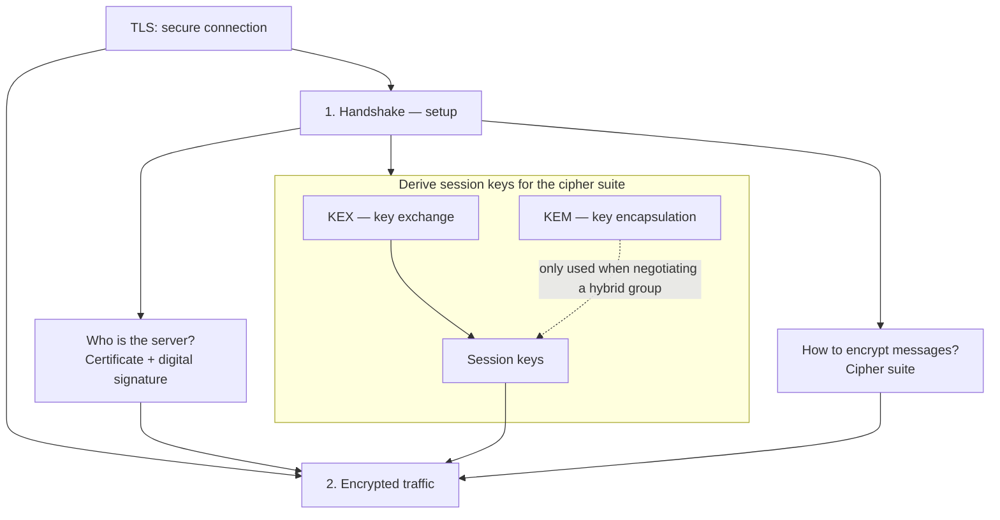

# Lab: Hybrid TLS with PQC

This exercise shows that post-quantum cryptography can already be negotiated in TLS 1.3. Two local handshakes with the repo image are enough: one classical and one hybrid using `X25519MLKEM768`.

Three ideas worth locking in early:

* PQC does not replace all of TLS. It affects specific parts of the **handshake**.
* The application layer stays the same. What changes is the **key exchange group** negotiated underneath.
* Operational cost does not vanish: it shows up in bytes, compatibility, and testing before you deploy.

If you can explain those three ideas in your own words at the end, the lab succeeded.

## TLS building blocks

TLS does two things: **setup** (handshake), then **encrypted traffic**. The handshake has three separate jobs—do not mix them up.



**KEX and KEM are two ways to do the same handshake job:** derive **session keys** for the negotiated **cipher suite**. They use different math; hybrid runs both (e.g. `X25519` + ML-KEM-768). Do not read “KEX = classical, KEM = PQC” as a rule, that is only how hybrid groups are built today.

| Handshake job         | Building blocks                | Classical demo      | Hybrid demo                  |
| --------------------- | ------------------------------ | ------------------- | ---------------------------- |
| Prove identity        | Certificate, digital signature | Same cert           | Same cert                    |
| Derive session keys   | **KEX**; optionally **KEM**    | KEX only (`X25519`) | KEX + KEM (`X25519MLKEM768`) |
| Choose how to encrypt | Cipher suite                   | Same AEAD           | Same AEAD                    |

Identity (signatures in certs) and key agreement (KEX/KEM) are **different axes**. Part 2 of this lab changes only the middle row.

## Start the environment

Run the container interactively:

```
docker run --rm -it ghcr.io/agmangas/pqc-openssl-lab:2026-06
```

You land in a menu with three demos and exit:

```
PQC OpenSSL Lab
================
1. View OpenSSL PQC capabilities
2. Compare classical vs hybrid PQC TLS
3. Compare signature sizes
4. Exit

Choose an option [1-4]:
```

Work through the three demos in order.

## Part 1: what OpenSSL supports

Option `1` asks OpenSSL which algorithms are available. On OpenSSL 3.5.x you should see three post-quantum families:

| Algorithm | Role                                                                                   | Note                                   |
| --------- | -------------------------------------------------------------------------------------- | -------------------------------------- |
| `ML-KEM`  | **Key encapsulation mechanism**; in TLS 1.3 contributes to handshake key establishment | It is a KEM, not a signature algorithm |
| `ML-DSA`  | Lattice-based **digital signatures**                                                   | Moderate signature size                |
| `SLH-DSA` | Hash-based **digital signatures**                                                      | Typically the largest signatures       |

Names on the list only mean the crypto provider implements them. Pause here before continuing.

> **Check your understanding.** If `ML-KEM` appears in the list, does that mean all HTTP traffic is encrypted with ML-KEM?

No. `ML-KEM` is used during the **handshake** to help establish keys. Application data is still protected with the usual **TLS 1.3 record ciphers** (`AES-GCM`, `ChaCha20-Poly1305`, …).

## Part 2: same TLS, different key exchange group

Option `2` runs two local TLS 1.3 handshakes. The exercise keeps almost everything fixed between them—the server certificate, TLS version, and negotiated **TLS 1.3 cipher suite** for record protection—and changes only the **key exchange group**:

| Mode       | Key exchange group | What it represents                            |
| ---------- | ------------------ | --------------------------------------------- |
| Classical  | `X25519`           | Elliptic-curve Diffie–Hellman (ECDHE)         |
| Hybrid PQC | `X25519MLKEM768`   | Hybrid group: X25519 combined with ML-KEM-768 |

In both runs you should still see TLS 1.3 and a typical record cipher. Focus on the **negotiated group**. In the hybrid case you should see:

```
Negotiated TLS group:      Negotiated TLS1.3 group: X25519MLKEM768
```

The demo also reports an approximate **ClientHello** size. On a local OpenSSL 3.5/3.6 build, the hybrid `ClientHello` is usually much larger than the classical one. That is not a quality score—it reflects more cryptographic material in the handshake messages.

> **Check your understanding.** The record cipher is the same in both runs. So what actually changed?

**Handshake key establishment** changed: how the initial shared secret is derived for the TLS 1.3 key schedule. The application protocol and symmetric record encryption can stay identical.

## Part 3: signatures and sizes

Option `3` signs the same message with three algorithms and compares public key and signature lengths. Output looks like:

```
Type                   Algorithm                    Public    Signature
----                   ---------                    ------    ---------
Modern classical       ED25519                         ...           64
PQC lattice            ML-DSA-65                       ...         3309
PQC hash-based         SLH-DSA-SHA2-128s               ...         7856
```

| Algorithm           | Category         | What to expect  |
| ------------------- | ---------------- | --------------- |
| `Ed25519`           | Classical        | Small signature |
| `ML-DSA-65`         | PQC (lattice)    | Much larger     |
| `SLH-DSA-SHA2-128s` | PQC (hash-based) | Larger still    |

The raw signature sizes shown here are fixed for these algorithms; public-key byte counts can differ if the encoding or OpenSSL output format changes. The pattern matters: PQC signatures are in the kilobyte range, not tens of bytes.

> **Check your understanding.** Why does that size difference matter in production?

Because the overhead lands in certificates, **handshake** messages, storage, MTU limits, legacy gear, and observability. It is not a single configuration flag you flip on.
